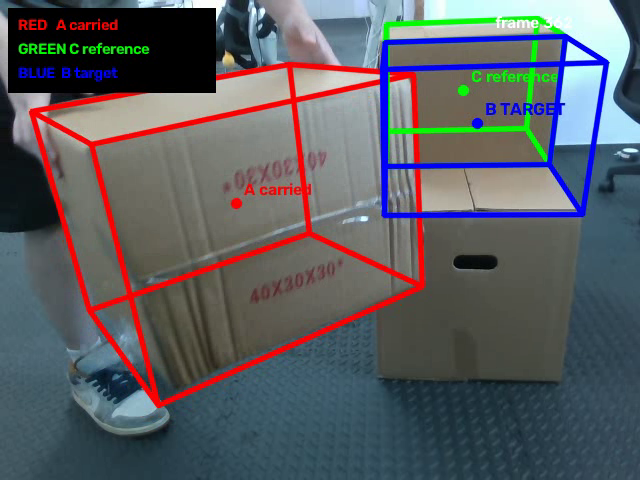

# FoundationPose for RGB-D Box Pose Tracking

**English** | [简体中文](README_zh-CN.md)

This repository adapts [NVIDIA FoundationPose](https://github.com/NVlabs/FoundationPose) for **6D pose estimation and continuous RGB-D tracking of a known package box**.

The focus of this repository is the **vision module only**: RGB-D acquisition, depth-to-color alignment, one-time object registration, continuous FoundationPose tracking, runtime benchmarking, offline replay, and tracking-stability analysis.

```text
RGB + aligned depth + camera intrinsics + box mesh
                         ↓
                one-time object mask
                         ↓
              FoundationPose register()
                         ↓
               continuous track_one()
                         ↓
              6D box pose in camera frame
```

## Demo


**Full continuous tracking sequence:** [Watch the full video](assets/demo/foundationpose_full.mp4)

The animated preview is a 10-second excerpt from the recorded RGB-D tracking sequence. It shows the FoundationPose box/axes together with the tracking FPS, tracking time, frame index, and estimated distance.

### Multi-box tracking and target pose generation

The offline pipeline also supports tracking two identical box instances with the same CAD model. The carried box **A** and reference box **C** are initialized with separate masks and maintained as independent FoundationPose tracking streams. The pose of **C** is then used to generate the desired placement target **B** for **A**.

```text
Carried box A   → FoundationPose → pose A
Reference box C → FoundationPose → pose C → target B
```

In the visualization, **red** denotes the carried box A, **green** the reference box C, and **blue** the generated target pose B. Instance identity is currently established by the separate initialization masks; automatic instance detection is not yet part of the pipeline.



---

# Environment setup

The setup below is the reproducible configuration used for the current implementation.

### Tested software stack

- Ubuntu Linux
- Python **3.11**
- CUDA Toolkit **12.8**
- PyTorch **2.7.1 + cu128**
- torchvision **0.22.1 + cu128**
- torchaudio **2.7.1 + cu128**
- PyTorch3D built from source
- NVDiffRast built from source

A recent NVIDIA GPU is required. The current high-rate benchmark was run on an RTX 5080.

## 1. Clone the repository

```bash
git clone https://github.com/Chris-airobot/FoundationPose.git
cd FoundationPose
```

## 2. Create the Conda environment

```bash
conda env create -f environment.yml
conda activate foundationpose
```

`environment.yml` installs Python 3.11 and the compiler/CMake dependencies required by the CUDA extensions.

## 3. Install PyTorch CUDA 12.8

```bash
python -m pip install \
  torch==2.7.1 torchvision==0.22.1 torchaudio==2.7.1 \
  --index-url https://download.pytorch.org/whl/cu128
```

Check that CUDA is visible:

```bash
python - <<'PY'
import torch
print('torch:', torch.__version__)
print('cuda available:', torch.cuda.is_available())
print('cuda:', torch.version.cuda)
if torch.cuda.is_available():
    print('gpu:', torch.cuda.get_device_name(0))
PY
```

## 4. Configure the CUDA toolkit

If CUDA 12.8 is installed in `/usr/local/cuda-12.8`:

```bash
export CUDA_HOME=/usr/local/cuda-12.8
export PATH="$CUDA_HOME/bin:$PATH"
export CPATH="$CUDA_HOME/targets/x86_64-linux/include:${CPATH:-}"
export C_INCLUDE_PATH="$CUDA_HOME/targets/x86_64-linux/include:${C_INCLUDE_PATH:-}"
export CPLUS_INCLUDE_PATH="$CUDA_HOME/targets/x86_64-linux/include:${CPLUS_INCLUDE_PATH:-}"
export LIBRARY_PATH="$CUDA_HOME/targets/x86_64-linux/lib:${LIBRARY_PATH:-}"
export LD_LIBRARY_PATH="$CUDA_HOME/targets/x86_64-linux/lib:${LD_LIBRARY_PATH:-}"
```

Change `CUDA_HOME` if CUDA is installed elsewhere.

## 5. Build/install GPU dependencies

```bash
python -m pip install --no-build-isolation \
  "git+https://github.com/facebookresearch/pytorch3d.git"

python -m pip install --no-build-isolation \
  "git+https://github.com/NVlabs/nvdiffrast.git"

python -m pip install -r requirements.txt
bash build_all_conda.sh
```

## 6. Verify the environment

```bash
python check_env.py
```

## 7. Download FoundationPose weights

Download the official pretrained FoundationPose weights from the upstream project and place them under `weights/` with this layout:

```text
weights/
├── 2023-10-28-18-33-37/    # refiner
│   ├── model_best.pth
│   └── config.yml
└── 2024-01-11-20-02-45/    # scorer
    ├── model_best.pth
    └── config.yml
```

Official weight link from NVIDIA FoundationPose:

https://drive.google.com/drive/folders/1DFezOAD0oD1BblsXVxqDsl8fj0qzB82i?usp=sharing

More installation notes are also kept in [`ENV_SETUP.md`](ENV_SETUP.md).

---

# Box model

The current object is approximated as a rectangular package box:

```text
Length: 0.40 m
Width:  0.30 m
Height: 0.30 m
```

The mesh is:

```text
box.obj
```

It can be regenerated with:

```bash
python makee_box.py
```

The origin is at the box center and the mesh units are metres.

Because the CAD/mesh is known, this repository uses the **model-based FoundationPose pipeline**. No object-specific network retraining is required.

---

# Input format

FoundationPose requires:

- RGB image
- depth image
- camera intrinsic matrix `K`
- object mesh
- one object mask for initial registration

A typical recorded sequence follows:

```text
sequence/
├── rgb/
│   ├── 000000.png
│   ├── 000001.png
│   └── ...
├── depth/
│   ├── 000000.png
│   ├── 000001.png
│   └── ...
├── masks/
│   └── 000000.png
└── cam_K.txt
```

Depth is stored as 16-bit millimetres and converted to metres before being passed to FoundationPose.

Correct **depth-to-color alignment** is important because pose quality degrades when RGB and depth use mismatched image geometry.

---

# Basic model-based test

For an RGB-D sequence already stored in FoundationPose format:

```bash
conda activate foundationpose

python run_demo.py \
  --mesh_file box.obj \
  --test_scene_dir demo_data/box_test \
  --debug 2 \
  --debug_dir debug_box_test
```

FoundationPose performs `register()` on the first frame and then automatically uses `track_one()` for the remaining frames.

---

# RealSense RGB-D capture

A standalone RealSense recorder is provided:

```bash
python -m pip install pyrealsense2
python capture_realsense_box.py --list-devices
```

To record a sequence:

```bash
python capture_realsense_box.py \
  --serial REPLACE_WITH_SERIAL \
  --output-dir demo_data/box_test
```

The recorder:

- aligns depth to color;
- saves RGB frames;
- saves depth as 16-bit millimetres;
- stores camera intrinsics in `cam_K.txt`;
- creates the first-frame mask interactively.

---

# Live tracking

The main live tracking script is:

```text
g1/scripts/live_foundationpose_box.py
```

It receives a 640 × 480 RGB-D stream through ZMQ, performs one registration, and then continuously tracks the box.

```bash
conda activate foundationpose
python -u g1/scripts/live_foundationpose_box.py
```

Controls:

```text
q  quit
r  redraw the object mask and re-register
```

The latest estimated 4×4 pose is saved to:

```text
g1/results/live_foundationpose/latest_pose.txt
```

The pose is the object transform in the **camera coordinate frame**.

The live loop uses:

- `TRACK_ITERS = 1`;
- ZMQ `CONFLATE=1` to discard stale frames rather than build latency;
- decimated visualization;
- reduced disk writes.

The terminal reports:

```text
camera-arrival FPS=... | pose-output FPS=... | track=... ms
```

---

# Runtime benchmark

The core benchmark is:

```bash
python -u g1/scripts/benchmark_foundationpose_core.py
```

It preloads RGB-D frames into RAM, performs one registration, warms up the tracker, then measures repeated `track_one()` calls without normal visualization/disk-I/O overhead.

### Measured result

| Metric | Result |
|---|---:|
| Core tracking throughput | **104.7 FPS** |
| Mean tracking time | **9.55 ms/frame** |
| p95 tracking time | **12.51 ms/frame** |

These numbers measure the FoundationPose tracking core. Full live throughput can be lower because camera capture, alignment, transfer, decoding, and visualization add overhead.

---

# Distance and tracking-stability results

A dedicated RGB-D recording was used to evaluate FoundationPose tracking stability as the box-camera distance changed.

### Recorded dataset

| Item | Result |
|---|---:|
| Frames | **2692** |
| Capture rate | **29.91 FPS** |
| RGB/depth readability | **100%** |
| RGB/depth shape match | **100%** |
| Mean valid depth | **97.7%** |
| AprilTag detection coverage | **91.3%** |
| Tested distance range | **1.124–1.902 m** |

AprilTag was used mainly as a **distance reference**. It was not treated as perfect 6D ground truth for FoundationPose.

The analysis uses frame-to-frame FoundationPose translation and symmetry-aware rotation changes. For quasi-stationary frame pairs across all populated distance bins:

| Tracking-stability metric | Result |
|---|---:|
| p95 translation step | **≤ ~13 mm** |
| p95 symmetry-aware rotation step | **≤ ~4.4°** |
| Large-jump rate | **0%** |

### Conclusion

FoundationPose remained stable across the full tested range of approximately **1.1–1.9 m**. No sudden tracking degradation was observed inside this interval.

A conservative practical interpretation is:

- **1.1–1.9 m:** validated usable tracking range in the recorded experiment;
- **≤1.8 m:** comfortably supported by the available samples;
- **>1.9 m:** not established by this benchmark.

The 1.8–1.9 m bin contained fewer quasi-stationary samples (23 pairs), so the `≤1.8 m` statement is the more conservative one.

### Important limitation of this result

The sequence begins with **one successful FoundationPose registration** and then evaluates continuous `track_one()` tracking while distance changes. Therefore this experiment validates **tracking stability versus distance**, not the probability of successfully performing a fresh registration at every distance.

Because the box was moved by hand, the quasi-stationary frame-to-frame changes can also include small amounts of real object motion. The reported values should therefore be interpreted as an upper-bound style stability measure rather than pure estimator noise.

The analysis scripts are:

```text
g1/scripts/range_benchmark.py
g1/scripts/offline_fp_range_analysis.py
g1/scripts/compare_offline_fp_apriltag.py
g1/scripts/apriltag_gt_benchmark.py
```

---

# Offline recording and replay

The vision pipeline can be evaluated completely offline after RGB-D data is recorded.

Useful scripts include:

| Script | Purpose |
|---|---|
| `g1/scripts/record_offline_bundle.py` | Record reusable RGB-D bundles |
| `g1/scripts/verify_offline_bundle.py` | Validate RGB/depth data and extract AprilTag measurements |
| `g1/scripts/foundationpose_offline_bundle.py` | Run FoundationPose on a recorded bundle |
| `g1/scripts/replay_foundationpose_benchmark.py` | Replay/benchmark recorded sequences |
| `g1/scripts/compare_offline_fp_apriltag.py` | Visual sanity comparison with AprilTag reference geometry |
| `g1/scripts/offline_fp_range_analysis.py` | Analyze tracking stability versus distance |

This makes it possible to repeat tracking, timing, and distance experiments without reacquiring the same data.

---

# Project structure

```text
FoundationPose/
├── box.obj
├── makee_box.py
├── estimater.py
├── run_demo.py
├── capture_realsense_box.py
├── check_env.py
├── environment.yml
├── requirements.txt
├── ENV_SETUP.md
│
└── g1/
    ├── camera_server/              # RGB-D camera integration / alignment
    ├── data/                       # small configuration/example data
    └── scripts/
        ├── live_foundationpose_box.py
        ├── make_first_mask.py
        ├── record_offline_bundle.py
        ├── verify_offline_bundle.py
        ├── foundationpose_offline_bundle.py
        ├── replay_foundationpose_benchmark.py
        ├── benchmark_foundationpose_core.py
        ├── range_benchmark.py
        ├── offline_fp_range_analysis.py
        ├── apriltag_gt_benchmark.py
        └── compare_offline_fp_apriltag.py
```

Large RGB-D recordings, generated visualizations, benchmark outputs, and logs should remain outside normal Git commits.

---

# Current limitation

The main remaining perception limitation is initialization:

> **The first object mask is manually supplied.**

After registration, FoundationPose tracks continuously without requiring a new segmentation mask on each frame. A detector or segmentation model could be added later if fully automatic initialization is required.

---

# Upstream FoundationPose

This repository is based on the official NVIDIA Research implementation:

- Repository: https://github.com/NVlabs/FoundationPose
- Project page: https://nvlabs.github.io/FoundationPose/
- Paper: *FoundationPose: Unified 6D Pose Estimation and Tracking of Novel Objects*, CVPR 2024 Highlight

Please refer to the upstream project for the original pretrained weights, public-dataset instructions, model-free workflow, and full method documentation.

## Citation

```bibtex
@InProceedings{foundationposewen2024,
  author    = {Bowen Wen and Wei Yang and Jan Kautz and Stan Birchfield},
  title     = {FoundationPose: Unified 6D Pose Estimation and Tracking of Novel Objects},
  booktitle = {CVPR},
  year      = {2024}
}
```

# License

The upstream FoundationPose code and data are released under the NVIDIA Source Code License. See `LICENSE` and the original NVIDIA repository for details.
